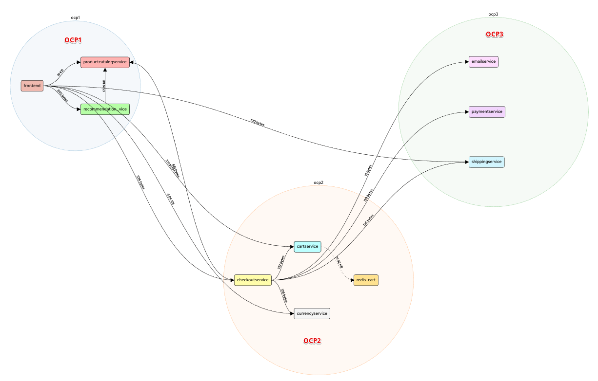
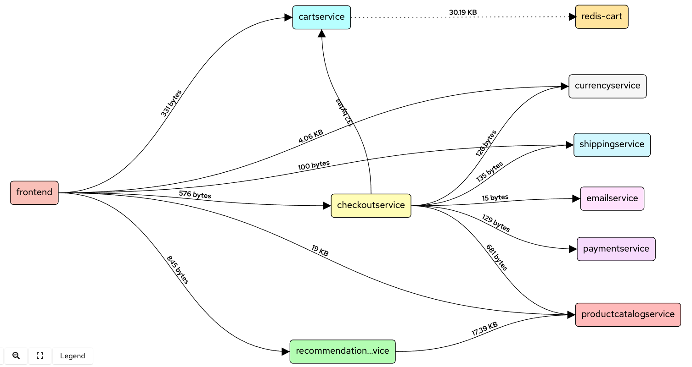
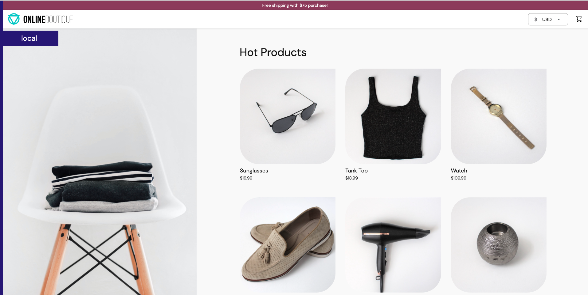
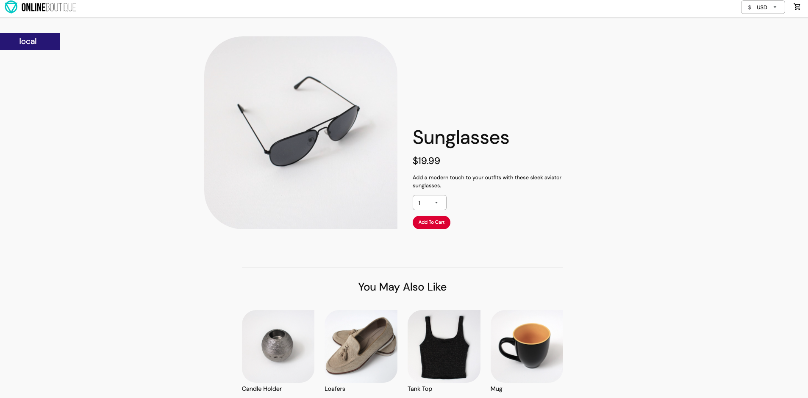
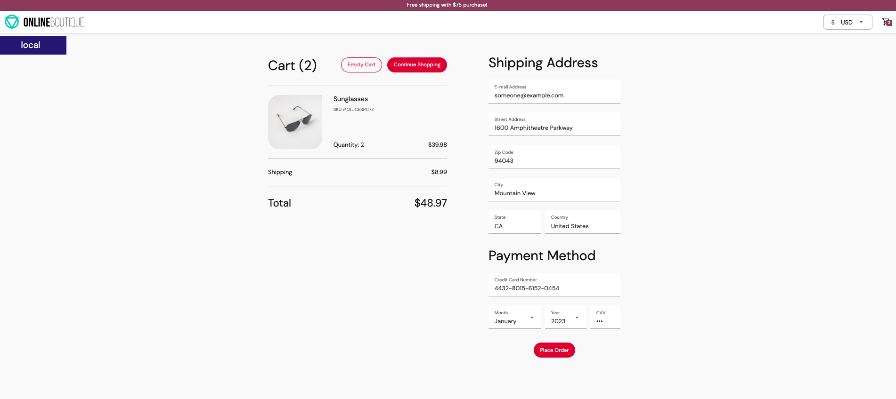
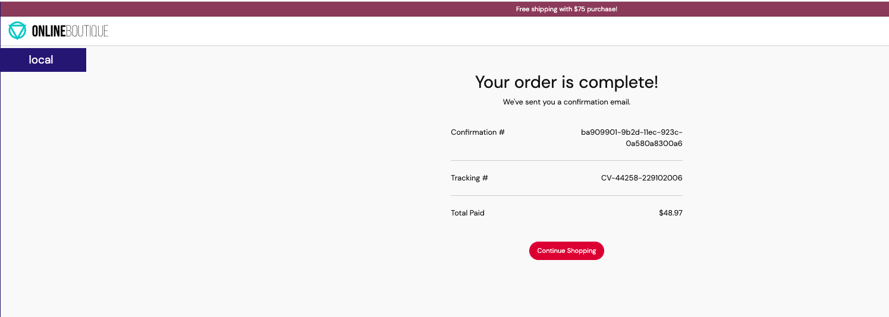

# Introduction

## Microservices Application Architecture

**Online Boutique (e-commerce)** application is composed of 11 microservices written in different
languages that talk to each other over gRPC. See the [Development Principles](/docs/development-principles.md) doc for more information.

[](./images/architecture-diagram.png)


| Service                                              | Language      | Description                                                                                                                       |
| ---------------------------------------------------- | ------------- | --------------------------------------------------------------------------------------------------------------------------------- |
| frontend                          | Go            | Exposes an HTTP server to serve the website. Does not require signup/login and generates session IDs for all users automatically. |
| cartservice                     | C#            | Stores the items in the user's shopping cart in Redis and retrieves it.                                                           |
| productcatalogservice | Go            | Provides the list of products from a JSON file and ability to search products and get individual products.                        |
| currencyservice          | Node.js       | Converts one money amount to another currency. Uses real values fetched from European Central Bank. It's the highest QPS service. |
| paymentservice              | Node.js       | Charges the given credit card info (mock) with the given amount and returns a transaction ID.                                     |
| shippingservice             | Go            | Gives shipping cost estimates based on the shopping cart. Ships items to the given address (mock)                                 |
| emailservice              | Python        | Sends users an order confirmation email (mock).                                                                                   |
| checkoutservice          | Go            | Retrieves user cart, prepares order and orchestrates the payment, shipping and the email notification.                            |
| recommendationservice| Python        | Recommends other products based on what's given in the cart.                                                                      |
| adservice                        | Java          | Provides text ads based on given context words.                                                                                   |
| loadgenerator                | Python/Locust | Continuously sends requests imitating realistic user shopping flows to the frontend.                                              |


## Distributed Deployment Architecture



- Distributed Microservices Application Connectivity using Virtual Application Network



# Prerequisites
- 3 x OpenShift clusters
- OC CLI Installed
- Skupper Installed [docs](https://skupper.io/start/index.html#step-1-install-the-skupper-command-line-tool-in-your-environment)
```
curl https://skupper.io/install.sh | sh
```

# Preparation
- From Browser : Login to OpenShift Console of 3 cluster (OCP on AWS, OCP on IBM Cloud, OCP on Azure)
- From CLI : Open 3 terminals and login to each OCP cluster, verify that you are able to connect to each OpenShift cluster.
- Git Clone the repository
```
git clone https://github.com/ksingh7/openshift-multi-cloud-demo.git
cd openshift-multi-cloud-demo
```
- On all 3 OCP clusters create a project called `multi-cloud`
```
oc new-project multi-cloud
```
# Setup Virtual Application Network
On each cluster, using the skupper tool, define the Virtual Application Network and the connectivity for the peer clusters.

## On Cluster-1 (OCP on Azure)
On the first OCP cluster `ocp1`
- Deploy the `ocp1` application router
- Create a connection token for connections from the `ocp2` and `ocp3` clusters
```
skupper init --site-name ocp1
skupper token create ocp1-token.yaml --uses 2
```

## On Cluster-2 (OCP on AWS)
On the Second OCP cluster `opc2`
- Deploy the `ocp2` application router
- Create a connection token for connections from the `ocp3` and `ocp1` clusters

```
skupper init --site-name ocp2
skupper token create ocp2-token.yaml
skupper link create ocp1-token.yaml
```

## On Cluster-3 (OCP on IBM Cloud)
On the Second OCP cluster `opc3`
- Deploy the `ocp3` application router
- Define connections from `ocp2` and `ocp1` clusters
```
skupper init --site-name ocp3
skupper link create ocp1-token.yaml
skupper link create ocp2-token.yaml
```
## Verify Link Status
- Wait for a few seconds and check link status on all 3 clusters
```
skupper link status
```

# Distributed deployment of Application Microservices across 3 clusters

Once the virtual network is set up, we can deploy the e-commerce application microservices across the 3 clusters.

| Deployment           | Microservices
| -------------------- | ---------------------------------------- |
| msa_deployment-ocp1.yaml | frontend, productcatalog, recommendation |
| msa_deployment-ocp2.yaml | cart, checkout, currency, redis-cart, ad |
| msa_deployment-ocp3.yaml | email, payment, shipping                 |

- OCP on Azure (ocp1) Cluster
```
oc apply -f msa_deployment-ocp1.yaml
```

- OCP on AWS (ocp2) Cluster
```
oc apply -f msa_deployment-ocp2.yaml
```
> Note : If cartservice pod does not start, it is likely due to the fact that the its unable to find redis-cart service, which will be fixed in the next step.

- OCP on IBM Cloud (ocp3) Cluster
```
oc apply -f msa_deployment-ocp3.yaml
```

# Expose the Microservices to Virtual Application Network

These files expose the services created above to join the Virtual Application Network. Note that the frontend service is not assigned to the Virtual Application Network as it is setup for external web access.


| File                    | Deployments
| ----------------------- | ---------------------------------------- |
| expose-deployments-ocp1.sh | productcatalog, recommendation           |
| expose-deployments-ocp2.sh | cart, checkout, currency, redis-cart, ad |
| expose-deployments-ocp3.sh | email, payment, shipping                 |

- OCP on Azure (ocp1) Cluster
```
sh expose-deployments-ocp1.sh
```

- OCP on AWS (ocp2) Cluster
```
sh expose-deployments-ocp2.sh
```

- OCP on IBM Cloud (ocp3) Cluster
```
sh expose-deployments-ocp3.sh
```
> Note : Scale down and scale up cartservice deployment
```
oc scale deployment cartservice --replicas=0
oc scale deployment cartservice --replicas=1
```

# Accessing the Microservices Application

At this stage we have 3 OCP clusters, on which we have distributedly deployed the microservices for e-commerce application. These microservices are exposed to the Virtual Application Network and over this network each microservice will connect with other microservices running on other OCP clusters. 

- From OCP1 cluster grab the application frontend URL
```
echo "http://"$(oc get service frontend-external -o=jsonpath='{.status.loadBalancer.ingress[0].ip}')
```

- Landing page



- Product page



- Cart and Payment Page



- Order Confirmation Page



# Accessing Skupper Dashboard for Intra-Cluster Visulization

- From your first OCP cluster, grab the skupper dashboard URL
```
oc get route skupper
```
- The username is `admin` and you can extract the password from the secret, like this
```
oc get secret skupper-console-users -o json | jq -r .data.admin | base64 -d
```
# Cleanup
To purge the setup, run the following commands

- OCP on Azure (ocp1) Cluster
```
sh purge-ocp1.sh
```

- OCP on AWS (ocp2) Cluster
```
sh purge-ocp2.sh
```

- OCP on IBM Cloud (ocp3) Cluster
```
sh purge-ocp3.sh
```

### Credits
This repository heavily uses open-source microservices-demo project. You can check out the main project [here](https://github.com/GoogleCloudPlatform/microservices-demo)